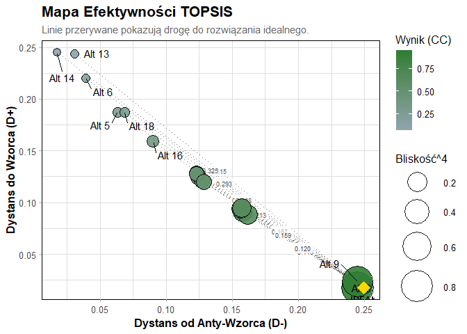

<!-- README.md is generated from README.Rmd. Please edit that file -->

# ClickbaitRankR

<!-- badges: start -->

<!-- badges: end -->

The goal of ClickbaitRankR is to provide a comprehensive analytical
framework for evaluating the credibility of online articles and
identifying various forms of media manipulation using Fuzzy
Multi-Criteria Decision Analysis (MCDA)

The package implements a full analytical pipeline: from raw survey data
and expert evaluations, through criterion weighting using the Best-Worst
Method (BWM), to final rankings using Fuzzy TOPSIS, VIKOR, and WASPAS
algorithms.

## Installation

You can install the development version of ClickbaitRankR from
[GitHub](https://github.com/) with:

``` r
# install.packages("devtools")
devtools::install_github("KrzyweOkulary/ClickbaitRankR")
```

## Quick Start

Here is a basic example of how to evaluate article reliability using the
built-in dataset :

``` r
library(ClickbaitRankR)
library(ggplot2)
#> Warning: pakiet 'ggplot2' został zbudowany w wersji R 4.5.3

# 1. Load the sample clickbait dataset
data("mcda_dane_surowe")

# 2. Define the model syntax (grouping raw variables into criteria)
# We use the =~ operator to define which variables belong to which criterion[cite: 317, 331].
clickbait_syntax <- "
  Credibility =~ autor_transparentnosc + autor_ekspertyza;
  Sensationalism =~ jezyk_hiperbola + clickbait_luka_informacyjna;
  Visuals =~ wizual_wykres_osie + wizual_zdjecie_kontekst
"

# 3. Prepare the Fuzzy Decision Matrix (TFN)
# This scales data to 1-9 and transforms it into Triangular Fuzzy Numbers [cite: 310-314].
fuzzy_mat <- przygotuj_dane_mcda(
  dane = mcda_dane_surowe, 
  skladnia = clickbait_syntax, 
  kolumna_alternatyw = "Alternatywa"
)

# 4. Calculate ranking using Fuzzy TOPSIS
# We set "max" for Credibility and "min" for Sensationalism and Visuals[cite: 661].
results <- rozmyty_topsis(
  fuzzy_mat, 
  typy_kryteriow = c("max", "min", "min"),
  bwm_kryteria = c("Credibility", "Sensationalism", "Visuals"),
  bwm_najlepsze = c(1, 6, 8), # Credibility is the Best
  bwm_najgorsze = c(8, 3, 1)  # Visuals is the Worst
)
#> Obliczanie wag metodą BWM...

# 5. Visualize the Efficiency Map
# The plot method automatically recognizes the result class and draws a bubble chart[cite: 926].
plot(results)
```



\##Consensus Ranking

To ensure robust results, you can aggregate multiple MCDA methods into a
single meta-ranking :

``` r
meta_res <- fuzzy_meta_ranking(
  decision_mat = fuzzy_mat, 
  criteria_types = c("max", "min", "min"),
  bwm_best = c(1, 6, 8), 
  bwm_worst = c(8, 3, 1)
)
#> Obliczanie wag metodą BWM...
#> Obliczanie wag metodą BWM...
#> Obliczanie wag metodą BWM...

print(meta_res$comparison)
#>    Alternative R_TOPSIS R_VIKOR R_WASPAS Meta_Sum Meta_Dominance
#> 1            1        5       7        8        6              7
#> 2            2        4       4        5        4              4
#> 3            3       12      11       11       11             11
#> 4            4        3       3        3        3              3
#> 5            5       17      16       17       17             17
#> 6            6       18      18       18       18             18
#> 7            7       11      12       12       12             12
#> 8            8        1       1        1        1              1
#> 9            9        2       2        2        2              2
#> 10          10        6       8        9        8              8
#> 11          11       10      10       10       10             10
#> 12          12       14      14       14       14             14
#> 13          13       19      19       19       19             19
#> 14          14       20      20       20       20             20
#> 15          15       13      13       13       13             13
#> 16          16       15      15       15       15             15
#> 17          17        9       9        7        9              9
#> 18          18       16      17       16       16             16
#> 19          19        8       6        6        7              6
#> 20          20        7       5        4        5              5
```
