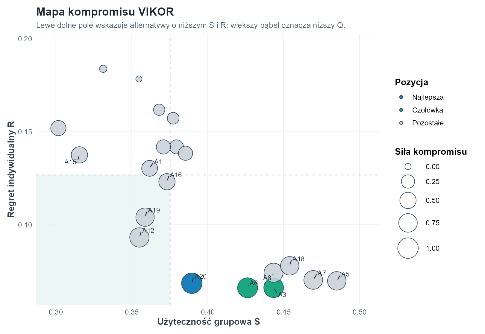
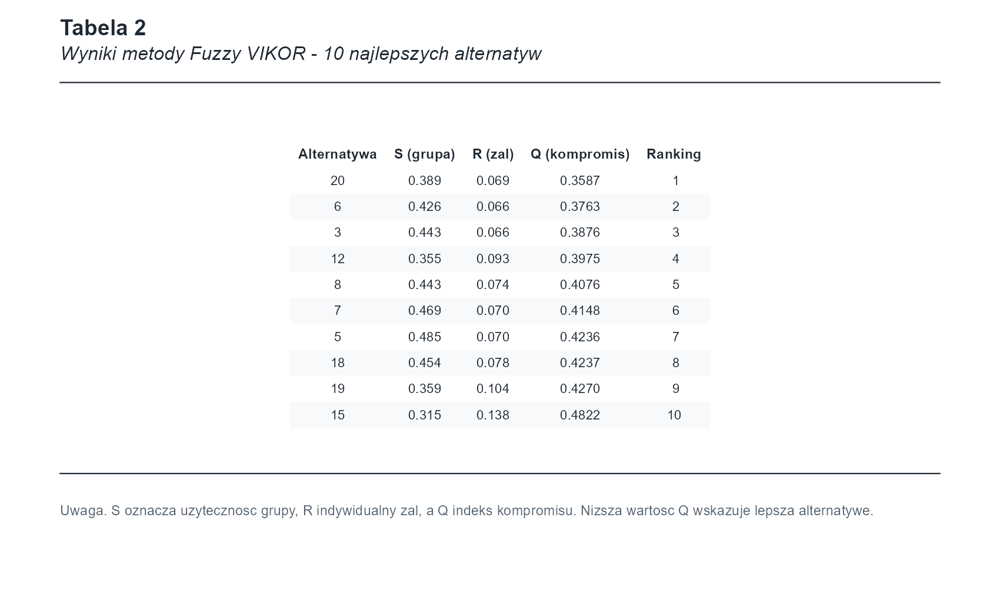

# ClickbaitRankR

ClickbaitRankR to pakiet R do obiektywnej, rozmytej analizy MCDA źródeł i artykułów clickbaitowych. Pakiet przekształca surowe dane eksperckie do trójkątnych liczb rozmytych TFN, wyznacza wagi kryteriów metodami obiektywnymi i buduje rankingi metodami Fuzzy TOPSIS, Fuzzy VIKOR oraz Fuzzy WASPAS.

Aktualna wersja pakietu nie korzysta z subiektywnych porównań par kryteriów. Dostępne są wyłącznie obiektywne metody wag:

- `oblicz_wagi_critic()` - metoda CRITIC, domyślna metoda ważenia;
- `oblicz_wagi_entropii()` - metoda entropii Shannona;
- `metoda_wag = "critic"` albo `metoda_wag = "entropia"` w funkcjach MCDA.

Główna rekomendowana ścieżka analityczna to Fuzzy VIKOR z wagami CRITIC, a TOPSIS, WASPAS i meta-ranking pełnią rolę porównawczą.

## Instalacja

```r
# install.packages("devtools")
devtools::install_github("KrzyweOkulary/ClickbaitRankR")
```

```r
library(ClickbaitRankR)
library(ggplot2)
```

## Dane

Pakiet zawiera przykładowy zbiór `mcda_dane_surowe`, czyli syntetyczne oceny eksperckie źródeł lub artykułów. Dane są tworzone przez procedurę DGP z katalogu `data-raw`.

```r
data("mcda_dane_surowe")
str(mcda_dane_surowe)
```

Każdy wiersz odpowiada jednej ocenie eksperta dla jednej alternatywy. Kolumna `Alternatywa` identyfikuje oceniany obiekt, a `EkspertID` identyfikuje eksperta.

## Składnia Modelu

Argument `skladnia` w funkcji `przygotuj_dane_mcda()` opisuje, które zmienne surowe tworzą poszczególne kryteria MCDA. Składnia jest podobna do zapisu modeli latentnych:

```r
Kryterium =~ zmienna_1 + zmienna_2 + zmienna_3;
```

Pełny przykład dla oceny clickbaitowości:

```r
skladnia_clickbait <- "
  Wiarygodnosc =~ autor_transparentnosc + autor_ekspertyza + autor_reputacja;
  Koszt =~ koszt_subskrypcji;
  Dostepnosc =~ dostep_do_tresci_bez_zalogowania;
  Jakosc_zrodel =~ multimedia_dowodowe + cytowania_ekspertow;
  Opoznienie_zrodel =~ zrodla_zewnetrzne;
  Sensacyjnosc =~ przymiotniki_emocjonalne + jezyk_hiperbola + clickbait_luka_informacyjna + clickbait_nacechowanie_wartosciujaco + clickbait_wrogi_jezyk;
  Zbalansowanie =~ zbalansowanie_stron + neutralnosc_naglowka;
  Manipulacja_faktami =~ fakt_wyrwanie_z_kontekstue + fakt_selektywnosc + fakt_anegdotyczny;
  Manipulacja_wizualna =~ wizual_wykres_osie + wizual_zdjecie_kontekst + wizual_retusz_sugestywny
"
```

Każda linia tworzy jedno kryterium. Jeśli kryterium ma kilka zmiennych, pakiet liczy średnią wierszową, a następnie skaluje wynik do wspólnej skali 1-9.

## Typy Kryteriów

Argument `typy_kryteriow` określa kierunek preferencji dla każdego kryterium. Kolejność musi być dokładnie taka sama jak kolejność kryteriów w `skladnia_clickbait`.

- `"max"` oznacza kryterium zyskowe: wyższa wartość jest lepsza.
- `"min"` oznacza kryterium kosztowe: niższa wartość jest lepsza.

```r
typy_kryteriow <- c(
  "max", # Wiarygodnosc
  "min", # Koszt
  "max", # Dostepnosc
  "max", # Jakosc_zrodel
  "min", # Opoznienie_zrodel
  "min", # Sensacyjnosc
  "max", # Zbalansowanie
  "min", # Manipulacja_faktami
  "min"  # Manipulacja_wizualna
)
```

Błędna kolejność typów zmienia interpretację wag i rankingów, dlatego warto trzymać definicję `typy_kryteriow` bezpośrednio pod `skladnia_clickbait`.

## Macierz TFN

Funkcja `przygotuj_dane_mcda()` przekształca dane surowe do rozmytej macierzy decyzyjnej:

```r
macierz_tfn <- przygotuj_dane_mcda(
  dane = mcda_dane_surowe,
  skladnia = skladnia_clickbait,
  kolumna_alternatyw = "Alternatywa"
)
```

Macierz ma wymiar `m x 3n`, gdzie:

- `m` to liczba alternatyw;
- `n` to liczba kryteriów;
- każde kryterium jest zapisane jako trójkątna liczba rozmyta `(l, m, u)`.

Dla wartości ostrej `x` pakiet tworzy TFN:

$$
\tilde{x}_{ij} = (l_{ij}, m_{ij}, u_{ij})
$$

gdzie:

$$
l_{ij} = \max(1, x_{ij} - 1), \quad
m_{ij} = x_{ij}, \quad
u_{ij} = \min(9, x_{ij} + 1).
$$

Defuzyfikacja w pakiecie wykorzystuje ważony środek TFN:

$$
\operatorname{defuzz}(l, m, u) = \frac{l + 4m + u}{6}.
$$

Ten sam wzór jest używany w obliczaniu wag obiektywnych oraz do sprowadzania rozmytych indeksów `S`, `R` i `Q` do wartości raportowanych w tabelach.

## Wagi Obiektywne

Najpierw macierz TFN jest defuzyfikowana do macierzy ostrej:

$$
x_{ij}^{c} = \frac{l_{ij} + 4m_{ij} + u_{ij}}{6}.
$$

Następnie kryteria są normalizowane z uwzględnieniem kierunku preferencji. Dla kryterium zyskowego:

$$
r_{ij} = \frac{x_{ij}^{c} - \min_i x_{ij}^{c}}
{\max_i x_{ij}^{c} - \min_i x_{ij}^{c}}.
$$

Dla kryterium kosztowego:

$$
r_{ij} = \frac{\max_i x_{ij}^{c} - x_{ij}^{c}}
{\max_i x_{ij}^{c} - \min_i x_{ij}^{c}}.
$$

### Entropia Shannona

Dla znormalizowanej macierzy `R = [r_ij]` liczone są proporcje:

$$
p_{ij} = \frac{r_{ij}}{\sum_{i=1}^{m} r_{ij}}.
$$

Entropia kryterium:

$$
e_j = -\frac{1}{\ln(m)} \sum_{i=1}^{m} p_{ij}\ln(p_{ij}).
$$

Stopień dywersyfikacji:

$$
d_j = 1 - e_j.
$$

Waga:

$$
w_j = \frac{d_j}{\sum_{j=1}^{n} d_j}.
$$

Im większa informacyjna zmienność kryterium, tym większa jego waga.

### CRITIC

Metoda CRITIC łączy zmienność kryterium z jego konfliktem względem innych kryteriów. Dla każdego kryterium:

$$
C_j = \sigma_j \sum_{k=1}^{n}(1 - \rho_{jk}),
$$

gdzie:

- `sigma_j` to odchylenie standardowe kryterium `j`;
- `rho_jk` to korelacja między kryterium `j` i `k`.

Waga CRITIC:

$$
w_j = \frac{C_j}{\sum_{j=1}^{n} C_j}.
$$

CRITIC nadaje większą wagę kryteriom, które są jednocześnie zmienne i słabo redundantne względem pozostałych kryteriów.

```r
wagi_critic <- oblicz_wagi_critic(macierz_tfn, typy_kryteriow)
wagi_entropii <- oblicz_wagi_entropii(macierz_tfn, typy_kryteriow)
```

Przykładowe wagi dla danych pakietowych:

| Kryterium | CRITIC | Entropia Shannona |
|---|---:|---:|
| Wiarygodnosc | 0.0865 | 0.0973 |
| Koszt | 0.2321 | 0.1283 |
| Dostepnosc | 0.1518 | 0.0768 |
| Jakosc_zrodel | 0.0815 | 0.0871 |
| Opoznienie_zrodel | 0.0823 | 0.0848 |
| Sensacyjnosc | 0.0883 | 0.1089 |
| Zbalansowanie | 0.1064 | 0.2681 |
| Manipulacja_faktami | 0.0895 | 0.0945 |
| Manipulacja_wizualna | 0.0816 | 0.0543 |

## Fuzzy VIKOR

VIKOR jest w pakiecie metodą główną, ponieważ dobrze pasuje do problemu kompromisu: alternatywa powinna być możliwie dobra globalnie, ale nie powinna mieć skrajnie słabych wyników na pojedynczym ważnym kryterium.

```r
wynik_vikor <- rozmyty_vikor(
  macierz_decyzyjna = macierz_tfn,
  typy_kryteriow = typy_kryteriow,
  metoda_wag = "critic",
  v = 0.5
)
```

Dla każdego kryterium wyznaczane są rozwiązania idealne i anty-idealne. Dla kryterium zyskowego:

$$
f_j^* = \max_i f_{ij}, \quad f_j^- = \min_i f_{ij}.
$$

Dla kryterium kosztowego:

$$
f_j^* = \min_i f_{ij}, \quad f_j^- = \max_i f_{ij}.
$$

Następnie liczony jest rozmyty dystans znormalizowany względem rozwiązania idealnego. Na jego podstawie powstają:

$$
S_i = \sum_{j=1}^{n} w_j d_{ij},
$$

czyli użyteczność grupowa, oraz:

$$
R_i = \max_j(w_j d_{ij}),
$$

czyli indywidualny żal, rozumiany jako największa ważona strata na pojedynczym kryterium.

Indeks kompromisu:

$$
Q_i =
v \frac{S_i - S^*}{S^- - S^*}
+ (1-v)\frac{R_i - R^*}{R^- - R^*}.
$$

Niższe wartości `S`, `R` i `Q` są korzystniejsze. Ranking VIKOR jest tworzony rosnąco po `Def_Q`.

Przykładowa czołówka VIKOR dla danych pakietowych:

| Alternatywa | Def_S | Def_R | Def_Q | Ranking |
|---:|---:|---:|---:|---:|
| 20 | 0.3895 | 0.0686 | 0.3587 | 1 |
| 6 | 0.4262 | 0.0661 | 0.3763 | 2 |
| 3 | 0.4433 | 0.0662 | 0.3876 | 3 |
| 12 | 0.3550 | 0.0932 | 0.3975 | 4 |
| 8 | 0.4433 | 0.0743 | 0.4076 | 5 |
| 7 | 0.4694 | 0.0704 | 0.4148 | 6 |
| 5 | 0.4849 | 0.0699 | 0.4236 | 7 |
| 18 | 0.4539 | 0.0779 | 0.4237 | 8 |

## Wykres VIKOR

Metoda `plot()` dla obiektu `rozmyty_vikor_wynik` zwraca obiekt `ggplot`.

```r
p <- plot(wynik_vikor)
p
```

Interpretacja:

- oś X pokazuje `S`, czyli użyteczność grupową;
- oś Y pokazuje `R`, czyli indywidualny żal;
- większy bąbel oznacza niższą wartość `Q`, czyli silniejsze rozwiązanie kompromisowe;
- najlepsze alternatywy są bliżej lewego dolnego obszaru wykresu;
- kolory wyróżniają najlepszą alternatywę, czołówkę i pozostałe obiekty.



Wykres można zapisać standardowo:

```r
ggplot2::ggsave("vikor_plot.png", plot(wynik_vikor), width = 9, height = 6, dpi = 300)
```

## Tabela APA

Funkcja `tabela_apa()` tworzy sformatowaną tabelę typu `flextable`, gotową do eksportu do Worda.

```r
tabela_vikor <- tabela_apa(wynik_vikor)
tabela_vikor

flextable::save_as_docx(
  tabela_vikor,
  path = "wyniki_vikor.docx"
)
```

Dla czytelności w README pokazano 10 najlepszych alternatyw:

```r
wynik_vikor_top10 <- wynik_vikor
wynik_vikor_top10$wyniki <- head(
  wynik_vikor$wyniki[order(wynik_vikor$wyniki$Ranking), ],
  10
)

tabela_apa(
  wynik_vikor_top10,
  tytul = "Wyniki metody Fuzzy VIKOR - 10 najlepszych alternatyw"
)
```



Analogicznie można tworzyć tabele dla TOPSIS, WASPAS i meta-rankingu:

```r
tabela_apa(wynik_topsis)
tabela_apa(wynik_waspas)
tabela_apa(meta)
```

## TOPSIS I WASPAS

TOPSIS i WASPAS są dostępne jako metody porównawcze.

```r
wynik_topsis <- rozmyty_topsis(
  macierz_decyzyjna = macierz_tfn,
  typy_kryteriow = typy_kryteriow,
  metoda_wag = "critic"
)

wynik_waspas <- rozmyty_waspas(
  macierz_decyzyjna = macierz_tfn,
  typy_kryteriow = typy_kryteriow,
  metoda_wag = "critic"
)
```

TOPSIS ocenia bliskość alternatywy względem rozwiązania idealnego i anty-idealnego. WASPAS łączy komponent addytywny WSM i multiplikatywny WPM. W praktyce warto traktować je jako analizę odporności rankingu VIKOR.

## Meta-Ranking

Meta-ranking agreguje rangi z TOPSIS, VIKOR i WASPAS.

```r
meta <- fuzzy_meta_ranking(
  decision_mat = macierz_tfn,
  criteria_types = typy_kryteriow,
  metoda_wag = "critic"
)
```

Obiekt `meta` zawiera:

- `comparison` - tabelę rang metod składowych oraz rankingów konsensusu;
- `correlations` - korelacje rang Spearmana;
- `weights` - wektor wag użyty we wszystkich metodach składowych.

`Meta_Sum` powstaje przez rangowanie sumy rang z metod składowych. `Meta_Dominance` wybiera kolejne alternatywy przez prostą procedurę dominacyjną: na każdej pozycji sprawdzane jest, która alternatywa najczęściej zajmuje najlepszą dostępną pozycję w metodach składowych, a remisy są rozstrzygane przez mniejszą sumę rang.

Przykładowa czołówka meta-rankingu:

| Alternatywa | R_TOPSIS | R_VIKOR | R_WASPAS | Meta_Sum | Meta_Dominance |
|---:|---:|---:|---:|---:|---:|
| 20 | 1 | 1 | 6 | 1 | 1 |
| 14 | 6 | 13 | 1 | 2 | 2 |
| 6 | 4 | 2 | 16 | 4 | 3 |
| 8 | 2 | 5 | 15 | 5 | 4 |
| 19 | 3 | 9 | 11 | 7 | 5 |
| 12 | 5 | 4 | 14 | 6 | 6 |
| 3 | 12 | 3 | 18 | 9 | 7 |
| 18 | 7 | 8 | 19 | 11 | 8 |

Przykładowe korelacje rang:

|  | R_TOPSIS | R_VIKOR | R_WASPAS | Meta_Sum | Meta_Dominance |
|---|---:|---:|---:|---:|---:|
| R_TOPSIS | 1.000 | 0.808 | -0.271 | 0.886 | 0.958 |
| R_VIKOR | 0.808 | 1.000 | -0.621 | 0.695 | 0.820 |
| R_WASPAS | -0.271 | -0.621 | 1.000 | 0.039 | -0.233 |
| Meta_Sum | 0.886 | 0.695 | 0.039 | 1.000 | 0.920 |
| Meta_Dominance | 0.958 | 0.820 | -0.233 | 0.920 | 1.000 |

Jeśli VIKOR jest metodą główną, meta-ranking należy interpretować jako dodatkowy test stabilności, a nie jako automatyczny zamiennik rankingu VIKOR.

## Procedura DGP

Katalog `data-raw` zawiera skrypt generujący dane syntetyczne:

```r
source("data-raw/generuj_dane_mcda.R")
dane_dgp <- generuj_dane_clickbait(parametry_dgp)
```

Dane są generowane z wykorzystaniem zmiennej latentnej clickbaitowości, efektów ekspertów oraz ciężkoogonowych składników half-t i half-Cauchy. Matematyczny opis DGP znajduje się w `data-raw/README_DGP.md`.

Pełny test integracyjny DGP i wszystkich funkcji pakietu można uruchomić z katalogu głównego:

```r
source("data-raw/sprawdz_dgp_i_funkcje.R")
```

albo z terminala:

```bash
Rscript data-raw/sprawdz_dgp_i_funkcje.R
```

Test przechodzi przez generowanie danych, przygotowanie macierzy TFN, wagi CRITIC i entropii, TOPSIS, VIKOR, WASPAS, meta-ranking, wykres VIKOR oraz tabele APA.

## Minimalny Workflow

```r
library(ClickbaitRankR)
data("mcda_dane_surowe")

macierz_tfn <- przygotuj_dane_mcda(
  dane = mcda_dane_surowe,
  skladnia = skladnia_clickbait,
  kolumna_alternatyw = "Alternatywa"
)

wynik_vikor <- rozmyty_vikor(
  macierz_decyzyjna = macierz_tfn,
  typy_kryteriow = typy_kryteriow,
  metoda_wag = "critic"
)

plot(wynik_vikor)
tabela_apa(wynik_vikor)
```
